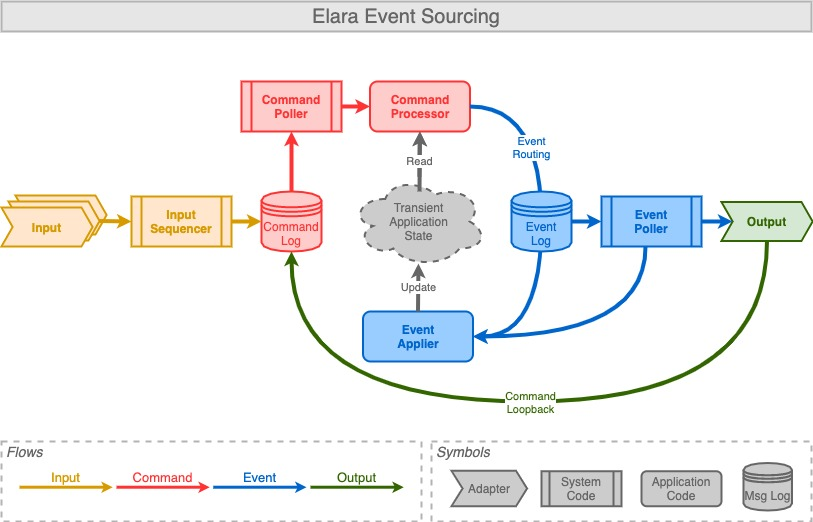

[](https://github.com/tools4j/elara/actions?query=workflow%3A%22Continuous+Integration%22)
[](https://search.maven.org/search?q=a:elara-*)
[](http://www.javadoc.io/doc/org.tools4j/elara-core)
## elara
The tools4j elara project provides an efficient, zero garbage framework to implement event sourcing applications.  

The event store is pluggable; a default implementation is available for [chronicle queue](https://github.com/OpenHFT/Chronicle-Queue).
  
Elara makes uses [direct buffers]() as defined by the [agrona](https://github.com/real-logic/agrona) library.  For this reason elara applications are perfectly suited to integrate with [SBE](https://github.com/real-logic/simple-binary-encoding) and [aeron](https://github.com/real-logic/aeron) UDP/IPC messaging.

The elara library is used productively in applications in the financial industry.  However elara is also under active development and some new plugins and features may be considered experimental especially if they are not released yet.

### Overview

#### Introduction
There are excellent introductions to event sourcing out there.  Some of our favorite links are
* https://microservices.io/patterns/data/event-sourcing.html
* https://www.youtube.com/watch?v=fhZwzm-d9ys
* https://martinfowler.com/eaaDev/EventSourcing.html

#### Elara Event Sourcing


#### Terminology 
* **Command:** essentially an input message but enriched with timestamp, source and sequence number; can be a state modifying command or a query
* **Event:** result of processing a command; instruction how to modify state or what output to generate
* **Command Log:** persisted log that sequentially stores all incoming commands
* **Event Log:** persisted event log that sequentially stores all routed events
* **Application State:** transient in-memory state of the application;  can be constructed from events via _Event Applier_
* **Input:** a source of input commands, such as a message subscription
* **Output:** transforms selected events into output messages and publishes them to downstream applications
* **Command Processor:** handles command messages and has read-only access to application state; routes events
* **Event Applier:** triggered by events (routed or replayed); modifies the application state according to the event instruction

### Samples

#### Banking application
A simple banking app that supports the following commands:
* Creation of a bank account
* Money deposit, withdrawal and transfer

Sample code and test to run:
* [bank sample](https://github.com/tools4j/elara/tree/master/elara-samples/src/main/java/org/tools4j/elara/samples/bank)
* [bank test](https://github.com/tools4j/elara/blob/master/elara-samples/src/test/java/org/tools4j/elara/samples/bank/BankApplicationTest.java)

#### Timers
Timers are tricky with event sourcing.  Elara provides timers through the [timer plugin](https://github.com/tools4j/elara/tree/master/elara-core/src/main/java/org/tools4j/elara/plugin/timer) with support for once-off and periodic timers.  The timer sample app demonstrates both timer types in action:
* [timer app](https://github.com/tools4j/elara/tree/master/elara-samples/src/main/java/org/tools4j/elara/samples/timer)
* [timer app test](https://github.com/tools4j/elara/blob/master/elara-samples/src/test/java/org/tools4j/elara/samples/timer/TimerApplicationTest.java)

### Maven/Gradle

#### Maven
```xml
<dependency>
        <groupId>org.tools4j</groupId>
        <artifactId>elara-core</artifactId>
        <version>1.3</version>
</dependency>
```

#### Gradle
```
api "org.tools4j:elara-core:1.3'
```

### Download
You can download binaries, sources and javadoc from maven central:
* [elara download](https://search.maven.org/search?q=a:elara-*)
